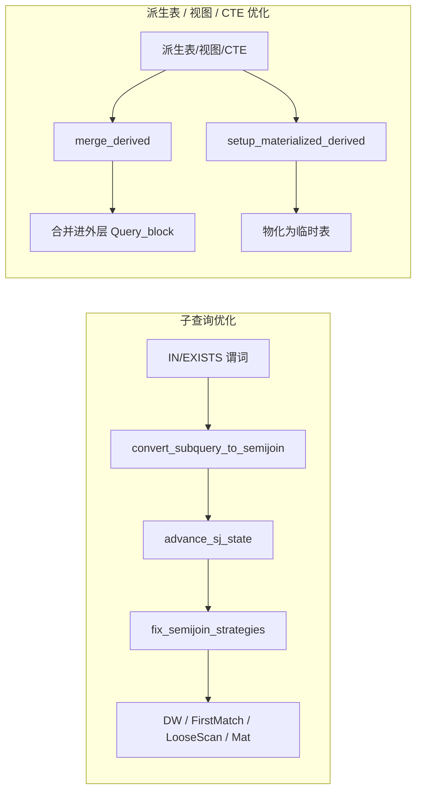

## MySQL 子查询与派生表优化概览（基于 8.0/8.4 行为）

> 目标：基于官方文档与源码，梳理 MySQL 针对子查询（IN / EXISTS）与派生表（含视图/CTE）的主要优化，并映射到源码中的关键实现函数，便于从“现象 → 实现”的双向理解。

---

## 一、子查询优化（IN / EXISTS / NOT IN / NOT EXISTS）

### 1.1 官方优化种类（文档视角）

MySQL 8.x 针对子查询（尤其是 `IN (...)`、`EXISTS (...)`、`NOT IN`、`NOT EXISTS`）的核心优化集中在三个方向：

- **Semijoin / Antijoin 转换**  
  - 将满足条件的 `IN (SELECT ...)`、`EXISTS (SELECT ...)` 改写为**半连接（semijoin）**；  
  - 将 `NOT IN` / `NOT EXISTS` 及其等价形式改写为**反连接（antijoin）**；  
  - 这样子查询就不再被“按外层行重复执行”，而是**融入外层 JOIN 计划**，可以选择多种执行策略。

- **五种 Semijoin 执行策略**（对 `IN` / `EXISTS` 有效）：  
  官方文档 *“Optimizing IN and EXISTS Subquery Predicates with Semijoin and Antijoin Transformations”* 中列出：
  - **Table pullout**：  
    把子查询里的表“拉”到外层，从语义上变成普通 INNER JOIN。
  - **Duplicate Weedout**：  
    按 JOIN 执行，但使用临时表按 rowid 去重，保证“存在即可”的语义。
  - **FirstMatch**：  
    对每个外层行，只要内表找到第一条匹配记录就停止扫描，跳过多余匹配。
  - **LooseScan**：  
    在子查询表上用索引做“分组扫描”，每组只取一个代表值。
  - **Materialization**：  
    将子查询结果物化到一个带索引的临时表中，对该临时表做 JOIN / 查找。

- **子查询物化（Subquery Materialization）**  
  - 对满足条件的 `IN (SELECT ...)` 子查询，MySQL 可以先执行一次子查询，将结果放入临时表（通常有哈希/BTREE 索引），然后对临时表做查找。  
  - 与“相关子查询每行执行一次”相比，物化策略往往能显著减少子查询执行次数。

**参考文档：**

- `10.2.2.1  Optimizing IN and EXISTS Subquery Predicates with Semijoin and Antijoin Transformations`
- `10.2.2.2  Optimizing Subqueries with Materialization`
- `10.2.2.3  Optimizing Subqueries with the EXISTS Strategy`

（可从 `https://dev.mysql.com/doc/refman/en/subquery-optimization.html` 导航）

---

### 1.2 源码中的关键实现（从 WHERE 子查询到执行策略）

下表按“**阶段 / 策略 → 实现函数 → 文件位置**”的方式整理了与子查询优化相关的主要入口：

| 优化阶段 / 策略                         | 实现函数 / 位置                                                                                                   | 说明                                                                                          |
| ---------------------------------- | ----------------------------------------------------------------------------------------------------------- | ------------------------------------------------------------------------------------------- |
| IN / EXISTS → Semijoin / Antijoin 转换 | `Query_block::convert_subquery_to_semijoin()`                                                               | 将符合条件的 `IN (SELECT ...)` / `EXISTS (SELECT ...)` 谓词改写为 semijoin/antijoin nest，插入外层 JOIN 结构。 |
| 调用入口                              | `sql/sql_resolver.cc` 附近 `Query_block::convert_subquery_to_semijoin()`、`resolve_predicate()` 调用处              | 发生在 **解析/resolve 阶段**，对子查询谓词 `Item_exists_subselect` 进行分析与改写。                       |
| Semijoin / Antijoin 判定                  | `Item_exists_subselect::can_do_aj`、`predicate->choose_semijoin_or_antijoin()`                                 | 判断是否可以做 antijoin（NOT IN / NOT EXISTS 场景）以及是否选择 semijoin 还是 antijoin。                      |
| Semijoin 策略状态推进（JOIN 顺序搜索中）      | `Optimize_table_order::advance_sj_state()`                                                                  | 在搜索 JOIN 顺序时维护“当前前缀下可用的 semijoin 策略集合”，用于剪枝与代价评估。                                       |
| 声明位置                              | `sql/sql_planner.h`（`Optimize_table_order` 成员）、`sql/sql_planner.cc` 中的 `best_extension_by_limited_search()` 等 | 伴随每次扩展 JOIN 前缀调用，以更新 semijoin 相关状态。                                                       |
| 最终策略固定与代价比较                       | `Optimize_table_order::fix_semijoin_strategies()`                                                           | 在决定最终 JOIN 顺序后，对每个 semijoin nest 在 Duplicate Weedout / FirstMatch / LooseScan / Materialization 间做代价比较，固定 `sj_strategy`。 |
| 实现位置                              | `sql/sql_planner.cc` 中 `Optimize_table_order::fix_semijoin_strategies()`                                      | 会设置 `POSITION::sj_strategy` 等字段，后续由执行阶段据此构造具体执行器。                                              |
| Duplicate Weedout 临时表实现            | `create_duplicate_weedout_tmp_table()`                                                                      | 为 Duplicate Weedout 策略创建按 rowid 去重的临时表。                                                          |
| 实现位置                              | `sql/sql_tmp_table.cc` 中表创建逻辑；`sql/sql_select.cc` 中在 semijoin 执行准备阶段调用                          | SELECT 的执行准备阶段会为需要 Duplicate Weedout 的 semijoin nest 创建临时表。                                  |
| Semijoin 物化执行结构                   | `class Semijoin_mat_exec`、`setup_semijoin_materialized_table()`                                               | 用于物化 semijoin 子查询结果并建立 Scan / Lookup 路径。                                                    |
| 实现位置                              | `sql/sql_executor.h` 中 `Semijoin_mat_exec`；`sql/sql_optimizer.cc` 中在 `JOIN::optimize()` 约 3183 行附近创建与初始化 | 在选定 semijoin materialization 策略后，构造 `Semijoin_mat_exec` 对象并调用 `setup_semijoin_materialized_table()`。 |
| IN 子查询的转换入口                       | `Item_in_subselect::select_transformer()` / `select_in_like_transformer()`                                  | 负责将 `expr IN (SELECT ...)` 转为 semijoin 或选择 materialization / EXISTS 策略的前置变换。                   |
| 实现位置                              | `sql/item_subselect.cc` 约 2383、2403 行                                                                      | 与 resolver 中的 `convert_subquery_to_semijoin()` 配合工作，并遵守文档中关于可转换条件的限制。                        |

> **说明**：  
> 子查询的 semijoin/antijoin 转换 + 策略选择，与 Range Optimizer 处理单表 `WHERE` 条件（如 `get_mm_tree()`、`get_ranges_from_tree()`）是两个相对独立的模块：  
> - **子查询优化**：决定 `IN/EXISTS` 用哪种**Join 风格**和执行策略（semijoin、antijoin、物化等）；  
> - **范围优化**：在决定好了“使用哪张表、哪种访问方式”之后，为该表构造具体的索引范围区间。

---

### 1.3 实现细节：从谓词到执行策略（源码视角）

下面按“调用顺序”稍微展开上表中的关键函数，方便从源码追踪：

- **1）`Item_in_subselect`：IN 子查询的前置改写**
  - 入口：`sql/item_subselect.cc` 中的  
    - `Item_in_subselect::select_transformer(THD *thd, Query_block *select)`  
    - `Item_in_subselect::select_in_like_transformer(...)`
  - 作用：
    - 针对 `expr IN (SELECT ...)`，先尝试做一系列“IN → EXISTS / semijoin / materialization”的改写（例如 `single_value_in_to_exists_transformer()`、`row_value_in_to_exists_transformer()` 等）；  
    - 若满足条件，则把该 `Item_in_subselect` 包装成 `Item_exists_subselect`，为后续 semijoin 转换铺路；  
    - 不满足条件时，保留为普通子查询，后续走 EXISTS 策略或通用 subquery materialization。

- **2）`Query_block::convert_subquery_to_semijoin()`：IN / EXISTS → semijoin / antijoin**
  - 位置：`sql/sql_resolver.cc`，声明在 `sql/sql_lex.h` 中。  
  - 作用：
    - 入参是 `Item_exists_subselect *subq_pred`，要求它是 IN/EXISTS 形式的子查询谓词；  
    - 检查是否满足文档里列出的 semijoin 条件（单一 SELECT、无 HAVING/聚合/LIMIT 等、ROW_COUNT 合法等）；  
    - 根据 `subq_pred->can_do_aj` 和 `subq_pred->choose_semijoin_or_antijoin()` 判断是否可以、是否要做 antijoin（NOT IN/NOT EXISTS 场景）；  
    - 在外层 `Query_block` 的 join 树中插入一个 semijoin/antijoin nest，把子查询的内表和谓词“并入”这个 nest，后续 JOIN 顺序搜索就可以把它当作一个特殊 join 结构处理。

- **3）`Optimize_table_order::advance_sj_state()`：JOIN 顺序搜索中的 semijoin 状态机**
  - 位置：`sql/sql_planner.h` / `sql/sql_planner.cc`。  
  - 作用：
    - 在 `best_extension_by_limited_search()`/`greedy_search()` 扩展 JOIN 前缀时，每加一张表都会调用 `advance_sj_state(remaining_tables, tab, idx)`；  
    - 维护“当前前缀下哪些 semijoin/antijoin nest 处于激活状态、允许哪些策略”的状态机，用于剪枝和后续代价计算；  
    - 同时考虑外连接、嵌套 join 等情况，保证 semijoin nest 的加入不破坏 join 语义。

- **4）`Optimize_table_order::fix_semijoin_strategies()`：最终策略选择**
  - 位置：`sql/sql_planner.cc`。  
  - 作用：
    - 在 JOIN 顺序确定后，对每个 semijoin nest 依次枚举 **FirstMatch / LooseScan / DuplicateWeedout / Materialization** 等候选策略；  
    - 调用 `semijoin_firstmatch_loosescan_access_paths()`、`semijoin_mat_scan_access_paths()`、`semijoin_mat_lookup_access_paths()`、`semijoin_dupsweedout_access_paths()` 等函数估算行数与代价；  
    - 选出代价最低的策略，写入 `POSITION::sj_strategy`，后续 `JOIN::optimize()` 会据此构建具体的执行结构（如 `Semijoin_mat_exec`）。

- **5）`create_duplicate_weedout_tmp_table()`：Duplicate Weedout 的临时表**
  - 位置：实现于 `sql/sql_tmp_table.cc`，在 `sql/sql_select.cc` 的 semijoin 准备阶段调用。  
  - 作用：
    - 创建一个带 rowid 的临时表，用于在 Duplicate Weedout 策略中对 JOIN 结果按“外表 rowid + 内表组键”去重；  
    - 配合 `semijoin_dupsweedout_access_paths()` 以及执行阶段的去重逻辑，实现“只关心是否存在匹配、不关心匹配次数”的语义。

- **6）`Semijoin_mat_exec` 与 `setup_semijoin_materialized_table()`：semijoin 物化执行**
  - 执行器类：`sql/sql_executor.h` 中的 `class Semijoin_mat_exec`；  
  - 准备逻辑：`sql/sql_optimizer.cc` 中的 `JOIN::optimize()`，在发现某个 semijoin nest 的 `sj_strategy` 为物化（`SJ_OPT_MATERIALIZE_SCAN/LOOKUP`）时：
    - `new (thd->mem_root) Semijoin_mat_exec(sj_nest, is_scan, table_count, outer_target, inner_target);`  
    - 调用 `setup_semijoin_materialized_table(tab, sjm_index, pos, ...)` 创建物化临时表以及对应的 scan / lookup AccessPath；  
  - 执行时由 `JOIN::exec()` 驱动，对 semijoin nest 先物化再按选择的策略访问。

整体来看，**子查询优化的“主干”调用链**大致可以概括为：

```text
Item_in_subselect::select_transformer()
  → 可能包装成 Item_exists_subselect
  → Query_block::convert_subquery_to_semijoin()
      （构建 semijoin/antijoin nest）
  → Optimize_table_order::advance_sj_state() / fix_semijoin_strategies()
      （在 JOIN 顺序搜索中选择 FirstMatch / LooseScan / DW / Mat）
  → JOIN::optimize() / Semijoin_mat_exec / create_duplicate_weedout_tmp_table()
      （构建具体执行器）
```

---

## 二、派生表 / 视图 / CTE 的优化（Merge vs Materialization）

### 2.1 官方优化种类（文档视角）

对于派生表（`FROM (SELECT ...) AS dt`）、视图与 CTE（`WITH cte AS (...)`），MySQL 8.x 的两大核心优化是：

- **Merge（合并）**
  - 尝试将派生表/视图/CTE **合并到外层查询块**，不单独执行、不物化临时表；
  - 等价于把内层的 SELECT 展开进外层的 FROM/JOIN/WHERE，实现更大的优化空间（谓词下推、JOIN 重排等）。

- **Materialization（物化）**
  - 将派生表/视图/CTE 执行一次，结果放入内部临时表；
  - 外层查询将其视为一张普通表使用；
  - 若不能合并（如含聚合、窗口函数、复杂语义）或合并后表数超限（如超过 61 张表）时采用。

**控制开关与 Hint：**

- `optimizer_switch` 中的 `derived_merge` flag（默认开启）；
- 语法层的 `MERGE` / `NO_MERGE` hint；
- 视图定义上的 `ALGORITHM=TEMPTABLE` 会强制物化视图，优先级高于 `derived_merge`。

官方文档参见：

- `10.2.2.4  Optimizing Derived Tables, View References, and Common Table Expressions with Merging or Materialization`

---

### 2.2 源码中的关键实现（从 Table_ref 到合并/物化）

| 优化方向         | 实现函数 / 位置                                                                                                 | 说明                                                                                                         |
| -------------- | --------------------------------------------------------------------------------------------------------- | ---------------------------------------------------------------------------------------------------------- |
| 派生表合并（MERGE）   | `Query_block::merge_derived()`                                                                            | 将派生表/视图的查询块合并到当前 `Query_block`：移动表列表、连接条件、WHERE 等，并调整表号与位图。                                 |
| 实现位置         | `sql/sql_resolver.cc` 中 `Query_block::merge_derived()`（约 3430 行）                                          | 检查 `is_mergeable()`、`derived_merge`、MERGE/NO_MERGE hint、`VIEW_ALGORITHM_TEMPTABLE` 等条件，合并后调用 `derived_table->set_merged()`。 |
| 合并决策调用点      | `sql/sql_resolver.cc` 中 resolve 过程中对每个 `Table_ref` 的处理（约 1309 行）                                      | 在 `tl->resolve_derived()` 之后，若 `tl->is_mergeable() && merge_derived(thd, tl)` 则合并；否则进入物化准备逻辑。                      |
| 派生表物化准备      | `Table_ref::setup_materialized_derived()`                                                                 | 为未合并的派生表准备物化：设置物化标记、只读属性、选择复用的 CTE 临时表或创建新表等。                                                |
| 实现位置         | `sql/table.h` 中 `Table_ref::setup_materialized_derived()` 声明；`sql/sql_derived.cc` 中约 815 行实现             | 内部直接调用 `setup_materialized_derived_tmp_table()`；成功后 `Table_ref` 处于“使用物化”的状态。                                |
| 物化临时表创建与填充   | `Table_ref::setup_materialized_derived_tmp_table()`、`Table_ref::create_materialized_table()`、`materialize_derived()` | 创建临时表结构（包含列定义、索引与存储选项），并执行派生表查询将结果写入临时表。                                                        |
| 实现位置         | `sql/sql_derived.cc` 中约 827、1627、1645 行                                                                  | 对未合并的派生表，在 resolve/optimize 阶段调用，完成物化表的构建与填充。                                                       |
| derived_merge 开关 | `sys_vars.cc` 中 `optimizer_switch` 的 `derived_merge`                                                      | 控制是否默认尝试合并；`sql/thd_raii.h` 中有 `Enable_derived_merge_guard`，用于在某些 SHOW/工具查询中临时开启合并。                     |

从调用顺序上看，一个派生表/视图/CTE 大致经历：

1. `resolve_derived()`：解析并准备内部查询块；
2. 若满足合并条件且允许合并 → `merge_derived()`：直接把内部查询展开放进外层；
3. 否则 → `setup_materialized_derived()` / `create_materialized_table()` / `materialize_derived()`：生成临时表并填充数据。

---

### 2.3 实现细节：派生表合并与物化（源码视角）

结合源码，可以把派生表/视图/CTE 的处理过程看成下面几步：

- **1）解析与准备：`resolve_derived()`**
  - 位置：`sql/sql_resolver.cc` 中对 `Table_ref` 列表的处理循环；  
  - 作用：
    - 对 `FROM (SELECT ...) AS dt`、视图、CTE 建立内部 `Query_expression` / `Query_block`；  
    - 调用内部查询块的 `prepare()`，完成列、类型、依赖关系的解析。

- **2）合并尝试：`Query_block::merge_derived(THD *thd, Table_ref *derived_table)`**
  - 位置：`sql/sql_resolver.cc`。  
  - 关键检查：
    - `derived_table->is_view_or_derived()` 且尚未合并（`!is_merged()`）；  
    - 外层 LEX 允许 merge（`can_use_merged()` / `can_not_use_merged()`）；  
    - ALGORITHM、MERGE/NO_MERGE hint、`optimizer_switch.derived_merge` 与 `merge_heuristic()` 一致允许合并；  
    - 若外层指定了 `STRAIGHT_JOIN`，且内部包含 semijoin/antijoin nest，则禁止合并（避免破坏 join 顺序语义）；  
    - 合并后总表数不超过 `MAX_TABLES`。
  - 合并动作：
    - 标记 `derived_table->set_merged()`；  
    - 把内部查询块的表、条件、列等并入当前 `Query_block`，调整所有相关的 `tableno()` 与 `table_map` 位图。

- **3）物化准备：`Table_ref::setup_materialized_derived(THD *thd)`**
  - 位置：声明于 `sql/table.h`，实现于 `sql/sql_derived.cc`。  
  - 作用：
    - 针对“未合并”的派生表，设置“将通过物化访问”的标志（`set_uses_materialization()`），并把该表的列视为只读；  
    - 若该派生表来自 CTE，且 CTE 已经有可复用的 tmp 表，则直接克隆；否则进入 tmp 表创建流程；  
    - 实际工作委托给 `setup_materialized_derived_tmp_table(thd)`。

- **4）临时表构建与填充：`setup_materialized_derived_tmp_table()` / `create_materialized_table()` / `materialize_derived()`**
  - 位置：`sql/sql_derived.cc`。  
  - 主要步骤：
    - `setup_materialized_derived_tmp_table()`：  
      - 记录 trace 信息（表名、select#、`materialized: true`）；  
      - 若是 CTE 且已有 tmp 表则复用；否则创建新表；  
    - `create_materialized_table()`：  
      - 根据内部查询块的输出列构造临时表结构（列类型、索引、存储引擎选项等）；  
    - `materialize_derived()`：  
      - 执行内部查询，将结果行插入刚创建的临时表；  
      - 完成后，外层 JOIN 把该派生表视为一张普通物理表，参与后续 Range 分析与索引选择。

因此，从“一个 `FROM (SELECT ...) AS dt`”到最终执行，可以概括为：

```text
Table_ref (view/derived/CTE)
  → resolve_derived() 准备内部 Query_block
  → 尝试 merge_derived()
       ✓ 成功：内部查询块展开放入外层，后续和普通表一起参与 JOIN/Range 优化
       ✗ 失败：调用 setup_materialized_derived()
             → setup_materialized_derived_tmp_table()
             → create_materialized_table() + materialize_derived()
             → 生成一张内部临时表供外层 JOIN 使用
```

这套机制，与子查询 semijoin/antijoin 优化一起，构成了 MySQL 8.0 在 **FROM 与谓词层面** 的主要结构性改写手段。

---

## 三、整体关系示意图（逻辑视角）

> 下图仅描述“优化方向之间的逻辑关系”，非精准调用顺序。



---

## 四、与条件优化与索引选择文档的衔接

当前仓库中已有文档：

- `Docs/mysql-condition-optimization-and-index-selection.md`

该文档主要围绕：

- `optimize_cond()` 进行的 **条件规范化/等值传播/常量折叠**；
- Range Optimizer 中 `SEL_TREE` / `SEL_ROOT` / `SEL_ARG` 的设计与 `get_mm_tree()` 构建过程；
- `test_quick_select()`、`get_key_scans_params()`、`check_quick_select()` 等**索引候选与代价评估逻辑**。

本文件补充的是另一个维度：

- **子查询层面**：IN / EXISTS / NOT IN / NOT EXISTS 如何被重写为 semijoin/antijoin，并在多种执行策略中择优；
- **FROM 层面**：派生表 / 视图 / CTE 如何在 MERGE 与物化之间做决策。

两者合起来，可以得到这样一条更完整的“优化链路”：

1. 解析阶段：构建 `Item` 表达式树、`Query_block` / `Table_ref` 结构；
2. 条件规范化：`optimize_cond()` 统一 WHERE 条件表达形式，为后续索引匹配准备输入；
3. 子查询与派生表优化：
   - 子查询：`convert_subquery_to_semijoin()` → `advance_sj_state()` / `fix_semijoin_strategies()` → 选定 semijoin/antijoin 策略；
   - 派生表：`merge_derived()` 或 `setup_materialized_derived()` → 合并或物化；
4. Range Optimizer：对每张表（含物化派生表）做 `get_mm_tree()` 与 `get_key_scans_params()`，得到各索引候选；
5. 访问路径选择：`best_access_path()`、`calculate_scan_cost()`、`find_best_ref()` 综合 ref / range / index / ALL / index_merge 等方式，选出最终执行计划。

---

## 五、参考链接

- **子查询优化**  
  - `10.2.2.1  Optimizing IN and EXISTS Subquery Predicates with Semijoin and Antijoin Transformations`  
  - `10.2.2.2  Optimizing Subqueries with Materialization`  
  - `10.2.2.3  Optimizing Subqueries with the EXISTS Strategy`

- **派生表 / 视图 / CTE 优化**  
  - `10.2.2.4  Optimizing Derived Tables, View References, and Common Table Expressions with Merging or Materialization`

（以上章节均可在 MySQL 官方手册 `https://dev.mysql.com/doc/refman/en/` 中查阅，相应源码实现位于本仓库的 `sql/` 目录下，具体函数与文件位置见本文各表格。）

